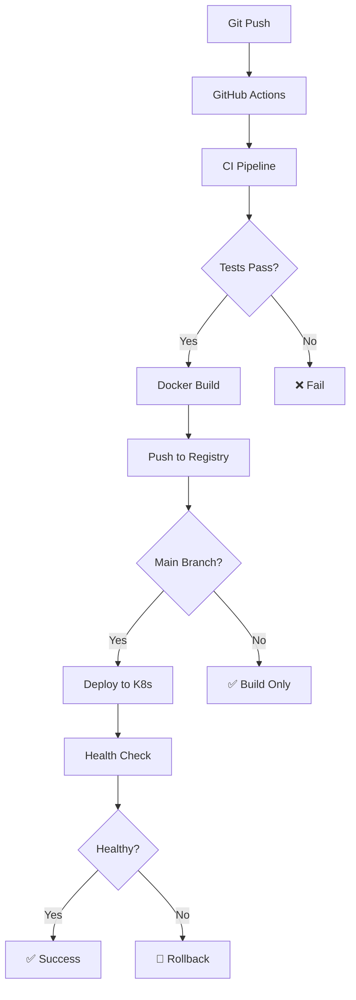

# 🚀 CI/CD Pipeline Setup - Complete Guide

## 📋 Overview

This guide sets up a complete CI/CD pipeline using GitHub Actions that automatically builds, tests, and deploys your CvetOchey application to Yandex Cloud Kubernetes whenever changes are made to the backend or frontend.

## 🎯 What This Pipeline Does

### 🔄 Continuous Integration (CI)
- **Backend**: Checkstyle linting, unit tests, Maven build
- **Frontend**: ESLint linting, Jest tests, Next.js build  
- **Security**: Trivy vulnerability scanning
- **Artifacts**: JAR files and build outputs

### 🚀 Continuous Deployment (CD)
- **Multi-arch Docker builds** (AMD64/ARM64)
- **Push to Yandex Container Registry**
- **Deploy to Kubernetes cluster** (master branch only)
- **Health check verification**
- **Rollback capability**

## ⚡ Quick Setup

### 1. Run the Setup Script
```bash
cd /Users/egorstukov/Developer/DevOps
./.github/setup-secrets.sh
```

This script will:
- ✅ Create GitHub Actions service account
- ✅ Assign required permissions
- ✅ Generate service account key
- ✅ Provide GitHub secrets configuration

### 2. Add Secrets to GitHub
Go to your GitHub repository:
**Settings → Secrets and variables → Actions → New repository secret**

Add these three secrets:
- `YC_SERVICE_ACCOUNT_KEY` (from script output)
- `YC_CLOUD_ID` (from script output)  
- `YC_FOLDER_ID` (from script output)

### 3. Test the Pipeline
```bash
# Make a small change to trigger deployment
echo "# Updated $(date)" >> README.md
git add .
git commit -m "test: trigger CI/CD pipeline"
git push origin master
```

## 📊 Pipeline Workflows

### CI Workflow (`ci.yaml`)
**Triggers**: Every push and pull request
```yaml
Jobs:
├── backend-lint      # Checkstyle validation
├── backend-test      # Unit tests with PostgreSQL  
├── backend-build     # Maven package
├── frontend-lint     # ESLint validation
├── frontend-test     # Jest unit tests
├── frontend-build    # Next.js production build
└── security-scan     # Trivy vulnerability scan
```

### Backend Deploy (`backend-deploy.yml`)
**Triggers**: Push to main/develop with backend changes
```yaml
Steps:
├── Multi-arch Docker build (AMD64/ARM64)
├── Push to cr.yandex/crpqt390b8gk59ipqid8/cvetochey-backend
├── Deploy to Kubernetes (main branch only)
├── Health check verification
└── Rollout status monitoring
```

### Frontend Deploy (`frontend-deploy.yml`)  
**Triggers**: Push to main/develop with frontend changes
```yaml
Steps:
├── Multi-arch Docker build (AMD64/ARM64)
├── Push to cr.yandex/crpqt390b8gk59ipqid8/cvetochey-frontend
├── Deploy to Kubernetes (main branch only)
├── Accessibility verification
└── Public endpoint testing
```

## 🔍 Monitoring Deployments

### GitHub Actions
- **Actions Tab**: View workflow runs and logs
- **Real-time logs**: Watch builds and deployments live
- **Artifacts**: Download build outputs

### Kubernetes Monitoring
```bash
# Watch deployments
kubectl get deployments -n cvetochey -w

# Check rollout status
kubectl rollout status deployment/backend -n cvetochey
kubectl rollout status deployment/frontend -n cvetochey

# View pod logs
kubectl logs -l app=backend -n cvetochey --tail=100 -f
kubectl logs -l app=frontend -n cvetochey --tail=100 -f
```

### Grafana Dashboard
Monitor deployment impact at:
**http://localhost:3001/d/cvetochey-monitoring/cvetochey-application-monitoring**

Watch for:
- 🔄 **Pod restarts** during deployment
- 📈 **Request rate** resuming after deployment
- ⚡ **Response times** staying stable
- 🚨 **Error rates** remaining low

## 🏗️ Architecture

### Container Registry Structure
```
cr.yandex/crpqt390b8gk59ipqid8/
├── cvetochey-backend:latest          # Latest main build
├── cvetochey-backend:main-abc123     # Specific commit
├── cvetochey-backend:develop-def456  # Develop branch
├── cvetochey-frontend:latest         # Latest main build
├── cvetochey-frontend:main-ghi789    # Specific commit
└── cvetochey-frontend:develop-jkl012 # Develop branch
```

### Deployment Flow


## 🔧 Customization

### Modify Triggers
```yaml
# Deploy on specific branches
on:
  push:
    branches: [ main, staging, production ]
    paths:
      - 'backend/**'
      - 'frontend/**'
```

### Add Environment-Specific Deployments
```yaml
# Deploy to different namespaces based on branch
- name: Set deployment namespace
  run: |
    if [[ "${{ github.ref }}" == "refs/heads/main" ]]; then
      echo "NAMESPACE=production" >> $GITHUB_ENV
    elif [[ "${{ github.ref }}" == "refs/heads/staging" ]]; then
      echo "NAMESPACE=staging" >> $GITHUB_ENV
    fi
```

### Custom Health Checks
```yaml
- name: Custom health verification
  run: |
    # Wait for custom endpoint
    timeout 300 bash -c 'until curl -f http://51.250.66.103:8080/api/health; do sleep 5; done'
    
    # Run integration tests
    kubectl run test-pod --image=curlimages/curl --rm -i --restart=Never -- \
      curl -f http://backend-service.cvetochey.svc.cluster.local:8080/api/v1/catalog
```

## 🛠️ Troubleshooting

### Common Issues

#### 1. Build Failures
```bash
# Check Dockerfile locally
docker build -t test-backend ./backend
docker build -t test-frontend ./frontend

# Verify dependencies
cd backend && mvn clean compile
cd frontend && pnpm install && pnpm build
```

#### 2. Registry Authentication
```bash
# Test registry login
echo "$YC_SERVICE_ACCOUNT_KEY" | base64 -d > key.json
yc config set service-account-key key.json
docker login cr.yandex --username json_key --password-stdin < key.json
```

#### 3. Kubernetes Deployment Issues
```bash
# Check cluster access
yc managed-kubernetes cluster get-credentials cvetochey-cluster --external
kubectl cluster-info

# Verify deployments
kubectl describe deployment backend -n cvetochey
kubectl get events -n cvetochey --sort-by='.lastTimestamp'
```

#### 4. Image Pull Errors
```bash
# Check image exists
yc container image list --registry-id crpqt390b8gk59ipqid8

# Test image pull
docker pull cr.yandex/crpqt390b8gk59ipqid8/cvetochey-backend:latest

# Check pod image pull status
kubectl describe pod <pod-name> -n cvetochey
```

### Debug GitHub Actions

#### Enable Debug Mode
```yaml
env:
  ACTIONS_STEP_DEBUG: true
  ACTIONS_RUNNER_DEBUG: true
```

#### Check Secrets
```yaml
- name: Verify secrets (non-sensitive check)
  run: |
    echo "YC_CLOUD_ID length: ${#YC_CLOUD_ID}"
    echo "YC_FOLDER_ID length: ${#YC_FOLDER_ID}"
    echo "Key length: ${#YC_SERVICE_ACCOUNT_KEY}"
```

## 🔄 Rollback Procedures

### Automatic Rollback
```bash
# Rollback to previous version
kubectl rollout undo deployment/backend -n cvetochey
kubectl rollout undo deployment/frontend -n cvetochey

# Check rollout history
kubectl rollout history deployment/backend -n cvetochey
```

### Manual Rollback to Specific Version
```bash
# Use specific image tag
kubectl set image deployment/backend \
  backend=cr.yandex/crpqt390b8gk59ipqid8/cvetochey-backend:main-previous-commit \
  -n cvetochey

# Wait for rollback completion
kubectl rollout status deployment/backend -n cvetochey
```

## 📈 Performance Optimization

### Build Performance
- ✅ **Docker layer caching** with GitHub Actions cache
- ✅ **Multi-stage builds** for smaller images
- ✅ **Parallel CI jobs** for faster feedback
- ✅ **Dependency caching** (Maven, pnpm)

### Deployment Performance
- ✅ **Rolling updates** for zero downtime
- ✅ **Readiness probes** for traffic routing
- ✅ **Resource limits** to prevent resource exhaustion
- ✅ **Multi-arch images** for optimal performance

## 🔒 Security Features

### Implemented Security
- ✅ **GitHub Secrets** for sensitive data
- ✅ **Service account** with minimal permissions
- ✅ **Vulnerability scanning** with Trivy
- ✅ **Non-root containers** in Docker images
- ✅ **Image signing** and verification

### Security Best Practices
- 🔄 **Rotate secrets** regularly (quarterly)
- 📊 **Monitor deployments** for anomalies
- 🛡️ **Network policies** in Kubernetes
- 🔍 **Audit logs** for compliance

## 🎯 Success Criteria

Your CI/CD pipeline is working correctly when:

### ✅ CI Pipeline
- All tests pass on every commit
- Builds complete without errors
- Security scans show no critical vulnerabilities
- Artifacts are generated and stored

### ✅ CD Pipeline  
- Images are built and pushed to registry
- Kubernetes deployments update successfully
- Health checks pass after deployment
- Zero downtime during deployments

### ✅ Monitoring
- Grafana shows deployment events
- Error rates remain low during deployments
- Response times stay stable
- HPA continues working after deployments

## 🚀 Next Steps

1. **Set up staging environment** for pre-production testing
2. **Add integration tests** to the pipeline
3. **Implement blue-green deployments** for even safer releases
4. **Set up alerts** for deployment failures
5. **Add performance testing** to catch regressions

Your CI/CD pipeline is now ready for production use! 🎉
