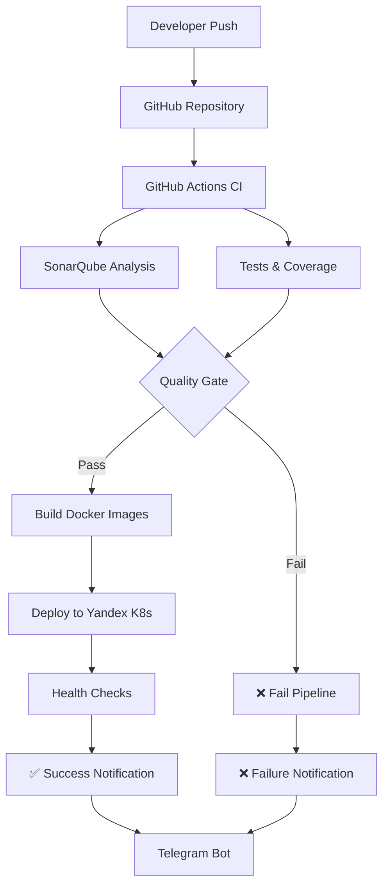

# DevOps Pipeline Setup Guide

This guide covers the complete setup of a professional DevOps pipeline for the CvetOchey project, including SonarQube code quality analysis, Telegram notifications, and continuous delivery.

## 🏗️ Architecture Overview



## 📋 Components

### 1. SonarQube Quality Analysis
- **Location**: `k8s/sonarqube.yaml`
- **Purpose**: Code quality analysis with 80% coverage requirement
- **Features**:
  - PostgreSQL database for persistence
  - Persistent volumes for data storage
  - Ingress configuration for external access
  - Quality gates with coverage thresholds

### 2. GitHub Actions Workflows
- **CI Pipeline**: `.github/workflows/ci.yaml`
- **CD Pipeline**: `.github/workflows/cd-pipeline.yml`
- **Telegram Notifications**: `.github/workflows/telegram-notifications.yml`

### 3. Telegram Bot Integration
- **Purpose**: Real-time notifications for repository activities
- **Events Covered**:
  - Push notifications
  - Pull request activities
  - Workflow status updates
  - Release notifications
  - Deployment status

### 4. Continuous Delivery
- **Trigger**: Successful merge to `dev` branch
- **Process**: Automated deployment to Yandex Cloud Kubernetes
- **Features**: Health checks and rollback capabilities

## 🚀 Setup Instructions

### Step 1: Deploy SonarQube to Yandex Cloud

1. **Connect to your Yandex Cloud Kubernetes cluster:**
   ```bash
   yc managed-kubernetes cluster get-credentials cvetochey-cluster --external
   ```

2. **Deploy SonarQube:**
   ```bash
   cd k8s
   ./setup-sonarqube.sh
   ```

3. **Access SonarQube:**
   - URL: `http://sonar.cvetochey.ru` (configure DNS)
   - Default credentials: `admin/admin`
   - **Important**: Change password on first login

### Step 2: Configure SonarQube Projects

1. **Create Backend Project:**
   - Project Key: `cvetochey-backend`
   - Project Name: `CvetOchey Backend`

2. **Create Frontend Project:**
   - Project Key: `cvetochey-frontend`
   - Project Name: `CvetOchey Frontend`

3. **Generate Project Tokens:**
   - Go to My Account > Security > Generate Tokens
   - Create tokens for both projects

### Step 3: Setup Telegram Bot

1. **Create Telegram Bot:**
   ```
   1. Message @BotFather on Telegram
   2. Send /newbot
   3. Follow instructions to create bot
   4. Save the bot token
   ```

2. **Get Chat ID:**
   ```
   1. Add bot to your group/channel
   2. Send a message to the bot
   3. Visit: https://api.telegram.org/bot<BOT_TOKEN>/getUpdates
   4. Find your chat ID in the response
   ```

### Step 4: Configure GitHub Secrets

Add the following secrets to your GitHub repository (`Settings > Secrets and variables > Actions`):

#### SonarQube Secrets
```
SONAR_TOKEN=<your-sonarqube-token>
SONAR_HOST_URL=http://sonar.cvetochey.ru
```

#### Telegram Secrets
```
TELEGRAM_BOT_TOKEN=<your-bot-token>
TELEGRAM_CHAT_ID=<your-chat-id>
```

#### Yandex Cloud Secrets (if not already configured)
```
YC_SERVICE_ACCOUNT_KEY=<base64-encoded-service-account-key>
YC_CLOUD_ID=<your-cloud-id>
YC_FOLDER_ID=<your-folder-id>
```

#### Optional: Codecov Integration
```
CODECOV_TOKEN=<your-codecov-token>
```

## 🔧 Configuration Details

### Backend Configuration

#### Maven Configuration (`backend/pom.xml`)
- **JaCoCo Plugin**: Code coverage analysis with 80% threshold
- **SonarQube Plugin**: Integration with SonarQube server
- **Coverage Rules**: Instruction and branch coverage at 80%

#### SonarQube Properties (`backend/sonar-project.properties`)
```properties
sonar.projectKey=cvetochey-backend
sonar.projectName=CvetOchey Backend
sonar.sources=src/main/java
sonar.tests=src/test/java
sonar.coverage.jacoco.xmlReportPaths=target/site/jacoco/jacoco.xml
```

### Frontend Configuration

#### Jest Configuration (`frontend/jest.config.ts`)
- **Coverage Threshold**: 80% for all metrics
- **Coverage Reports**: LCOV format for SonarQube integration

#### SonarQube Properties (`frontend/sonar-project.properties`)
```properties
sonar.projectKey=cvetochey-frontend
sonar.projectName=CvetOchey Frontend
sonar.sources=src
sonar.typescript.lcov.reportPaths=coverage/lcov.info
```

## 🔄 Pipeline Flow

### CI Pipeline (Triggered on Push/PR)
1. **Lint Check**: Code style validation
2. **Unit Tests**: Run tests with coverage
3. **SonarQube Analysis**: Quality gate validation
4. **Build**: Create artifacts if all checks pass

### CD Pipeline (Triggered on dev branch merge)
1. **Wait for CI**: Ensure CI pipeline passes
2. **Build Images**: Create Docker images for both services
3. **Deploy to K8s**: Update deployments in Yandex Cloud
4. **Health Checks**: Verify deployment success
5. **Notifications**: Send status to Telegram

### Quality Gates
- **Code Coverage**: Minimum 80% for both backend and frontend
- **Code Smells**: No critical issues allowed
- **Security Hotspots**: Must be reviewed
- **Duplicated Lines**: Below threshold
- **Maintainability Rating**: A or B grade required

## 📊 Monitoring and Notifications

### Telegram Notifications Include:
- ✅ Successful deployments
- ❌ Failed deployments
- 📋 Pull request activities
- 🚀 Push notifications
- 🎉 Release announcements
- ⚠️ Workflow failures

### SonarQube Metrics Tracked:
- Code coverage percentage
- Code smells and bugs
- Security vulnerabilities
- Technical debt
- Maintainability index

## 🛠️ Troubleshooting

### Common Issues

#### SonarQube Connection Issues
```bash
# Check SonarQube pod status
kubectl get pods -n sonarqube

# Check SonarQube logs
kubectl logs -l app=sonarqube -n sonarqube

# Port forward for local access
kubectl port-forward svc/sonarqube 9000:9000 -n sonarqube
```

#### Coverage Threshold Failures
- Ensure tests are comprehensive
- Check exclusions in configuration
- Review coverage reports in CI logs

#### Deployment Failures
```bash
# Check deployment status
kubectl get deployments -n cvetochey

# Check pod logs
kubectl logs -l app=backend -n cvetochey
kubectl logs -l app=frontend -n cvetochey

# Check rollout status
kubectl rollout status deployment/backend -n cvetochey
```

### Useful Commands

```bash
# View SonarQube service
kubectl get svc -n sonarqube

# Check ingress configuration
kubectl get ingress -n sonarqube

# View persistent volumes
kubectl get pv

# Check secrets
kubectl get secrets -n sonarqube
```

## 🔐 Security Considerations

1. **Change Default Passwords**: Update SonarQube admin password immediately
2. **Secure Tokens**: Use GitHub secrets for all sensitive data
3. **Network Policies**: Consider implementing network policies for pod communication
4. **RBAC**: Ensure proper role-based access control
5. **TLS**: Configure HTTPS for production SonarQube access

## 📈 Performance Optimization

1. **Resource Limits**: Adjust CPU/memory limits based on usage
2. **Storage**: Monitor persistent volume usage
3. **Caching**: Leverage GitHub Actions caching for dependencies
4. **Parallel Jobs**: Optimize workflow job dependencies

## 🔄 Maintenance

### Regular Tasks
- Monitor SonarQube disk usage
- Update SonarQube version periodically
- Review and update quality gate rules
- Clean up old workflow runs
- Update dependencies in CI/CD workflows

### Backup Strategy
- PostgreSQL database backups
- SonarQube configuration export
- Kubernetes resource definitions backup

## 📚 Additional Resources

- [SonarQube Documentation](https://docs.sonarqube.org/)
- [GitHub Actions Documentation](https://docs.github.com/en/actions)
- [Yandex Cloud Kubernetes Documentation](https://cloud.yandex.com/en/docs/managed-kubernetes/)
- [Telegram Bot API](https://core.telegram.org/bots/api)

---

**Note**: This setup provides a production-ready DevOps pipeline with comprehensive quality checks, automated deployment, and real-time notifications. Adjust configurations based on your specific requirements and security policies.
